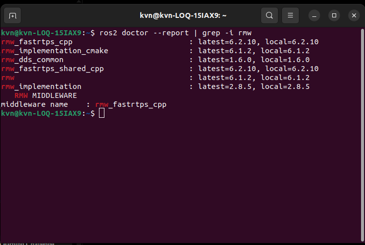

# Day 01 — Distributed Discovery in ROS 2

> **Engineering Question**
>
> **How do ROS 2 nodes find each other without a ROS Master?**

*(Public wording may say “discover”; curriculum and this README use “find” — same intent.)*

---

## Introduction

One of the biggest architectural changes in ROS 2 is the removal of the centralized **ROS Master (`roscore`)**.

ROS 2 nodes discover each other through **DDS** behind the **RMW** layer. This day is not about getting talker/listener to print Hello World — it is about verifying **how and why** that works, what `ROS_DOMAIN_ID` does, and how the ROS Graph changes when nodes join or leave.

---

## Environment

| | |
|---|---|
| OS | Ubuntu 22.04 LTS |
| ROS 2 | Humble Hawksbill |
| RMW | Fast DDS — `rmw_fastrtps_cpp` |
| Default experiment domain | `ROS_DOMAIN_ID=10` |
| Experiment scope | **One host** (localhost). Cross-machine discovery was not tested. |

### Confirm middleware

```bash
source /opt/ros/humble/setup.bash

ros2 doctor --report | grep -i rmw
```



---

## Architecture overview

```text
                ROS 2 Application
                        │
               rclpy / rclcpp
                        │
                       rcl
                        │
                       rmw
                        │
              Fast DDS (this day)
                        │
          Distributed Discovery
                        │
         Publisher  ↔  Subscriber
```

---

## Reproduction (quick start)

Every terminal:

```bash
source /opt/ros/humble/setup.bash
export ROS_DOMAIN_ID=10
```

| Terminal | Command |
|---|---|
| 1 | `ros2 run demo_nodes_cpp talker` |
| 2 | `ros2 run demo_nodes_cpp listener` |
| 3 | `ros2 node list` · `ros2 topic info /chatter` |

**Investigation B** uses talker on domain `10` and listener on domain `20`. After switching `ROS_DOMAIN_ID` for CLI checks, run `ros2 daemon stop` before `ros2 node list` (see Investigation B).

Full procedures: [A](investigations/A-automatic-discovery.md) · [B](investigations/B-domain-isolation.md) · [C](investigations/C-dynamic-discovery.md).

---

## Investigations

| Investigation | Question under test |
|---------------|---------------------|
| **[A – Automatic Discovery](investigations/A-automatic-discovery.md)** | Same domain: do talker and listener find each other without a Master? |
| **[B – Domain Isolation](investigations/B-domain-isolation.md)** | Does changing only `ROS_DOMAIN_ID` silently isolate two nodes? |
| **[C – Dynamic Discovery](investigations/C-dynamic-discovery.md)** | Does the ROS Graph update when nodes join and leave without restarting peers? |

---

## Key learnings

- ROS 2 discovery is **distributed** (DDS via RMW) — no Master.
- Publishers can run with **zero** subscribers.
- Subscribers can **join later** on the same domain and receive **new** samples (default demo QoS does not replay old ones).
- `ROS_DOMAIN_ID` creates **logical** isolation; mismatch fails silently.
- The ROS Graph is a **live** view of discovered participants.

---

## Engineering conclusion

**Answer:** ROS 2 nodes find each other through DDS-based discovery behind RMW. They share a domain (`ROS_DOMAIN_ID`), advertise endpoints, and match without `roscore`. Different domains do not discover each other. The graph updates as participants join and leave.

**Limits of this day’s evidence:** one laptop; Humble Fast DDS; default multicast. Docker, VPN, multicast-blocked networks, and multi-host setups can need extra discovery configuration — not covered here.

---

## Real robotics connection

Many robots share a network. Without domain isolation, unrelated systems can see each other’s topics. `ROS_DOMAIN_ID` is a simple control that keeps deployments separate. Dynamic join/leave matters when sensors, PCs, or robots start at different times — peers should not depend on a single Master process staying up.

---

## Repository layout

```text
day01-distributed-discovery/
├── README.md
├── investigations/
│   ├── A-automatic-discovery.md
│   ├── B-domain-isolation.md
│   └── C-dynamic-discovery.md
├── assets/                  # experiment screenshots + middleware check
├── assets/linkedin/         # LinkedIn draft + image order
├── interview_questions.md
└── references.md
```

---

## What's next?

**Day 02:** Should every sensor be a separate ROS 2 node?

*(Day 02 folder appears on GitHub when that day is published — see `PUBLISHING.md`.)*
