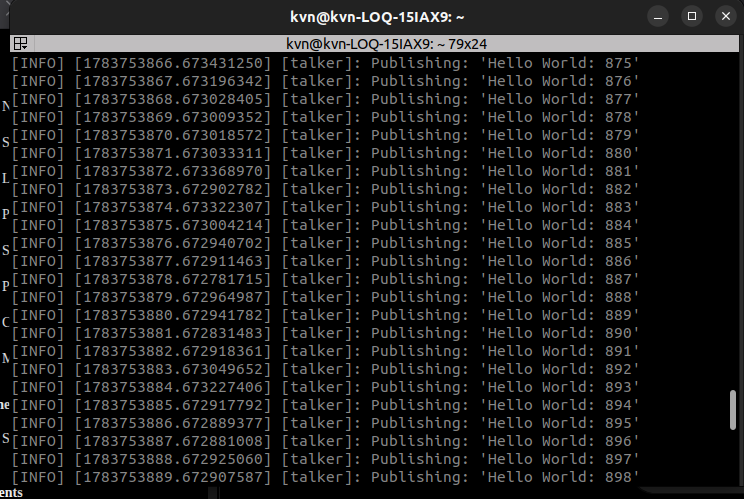
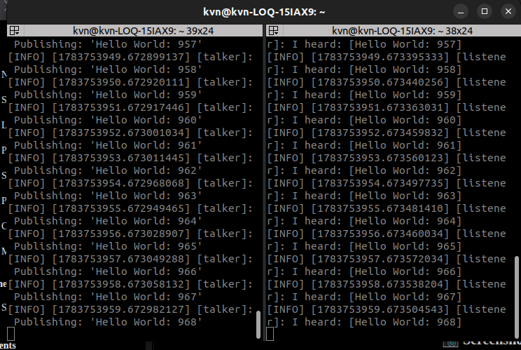

# Investigation A — Automatic Discovery

> **Engineering Question**
>
> **How do two ROS 2 nodes discover each other without a ROS Master?**

---

# Objective

To investigate how ROS 2 nodes automatically discover each other and communicate without requiring a centralized ROS Master (`roscore`).

---

# Hypothesis

Before performing the experiment, I expected that:

- Two ROS 2 nodes running in the same `ROS_DOMAIN_ID` would automatically discover each other.
- No ROS Master would be needed.
- On a single host with default Humble Fast DDS multicast, no manual peer or IP setup would be required.
- Communication should begin once a compatible publisher and subscriber exist on the same domain.

---

# Experimental Setup

| | |
|---|---|
| OS | Ubuntu 22.04 LTS |
| ROS | ROS 2 Humble |
| Middleware | Fast DDS (`rmw_fastrtps_cpp`) |
| Domain | `ROS_DOMAIN_ID=10` |
| Scope | One laptop (localhost). Cross-host discovery was not tested. |

---

# Commands Used

## Terminal 1 — Talker

```bash
source /opt/ros/humble/setup.bash

export ROS_DOMAIN_ID=10

ros2 run demo_nodes_cpp talker
```

---

## Terminal 2 — Listener (start after the talker has been publishing)

```bash
source /opt/ros/humble/setup.bash

export ROS_DOMAIN_ID=10

ros2 run demo_nodes_cpp listener
```

---

## Terminal 3 — Inspect the graph (same domain)

CLI tools must use the **same** Humble environment and `ROS_DOMAIN_ID` as the nodes. If this terminal is on domain `0` (unset), you will inspect the wrong graph.

```bash
source /opt/ros/humble/setup.bash

export ROS_DOMAIN_ID=10

ros2 node list

ros2 topic list

ros2 topic info /chatter

ros2 node info /talker
```

---

# Expected Results

- Talker publishes on `/chatter` even before any listener exists.
- No `roscore` / ROS Master is required.
- After the listener starts on domain `10`, it begins receiving **new** messages (matching sequence numbers with the talker).
- Late-joining listener does **not** receive samples published before it subscribed (default demo QoS is volatile).

---

# Actual Results

| Expectation | Observed |
|---|---|
| Talker runs alone without waiting | Confirmed — counter advanced with no subscriber (`expA_talker_without_listener.png`, counts ~875–898). |
| Listener joins without restarting talker | Confirmed — both panes show matching Hello World counts 957–968 (`expA_listener_joined.png`). |
| No Master required | Confirmed — only talker/listener processes; no `roscore`. |
| No old messages for late join | Consistent with default QoS; not shown as an overlapping pre-join count in the screenshots. Treat as expected middleware/QoS behaviour pending a dedicated late-join capture. |

---

# Evidence

## Talker running without any subscriber



---

## Listener joins an already running system



---

# Explanation

Unlike ROS 1, ROS 2 does not depend on a centralized ROS Master.

Every ROS 2 node uses the underlying DDS middleware (via RMW) for distributed discovery.

When a node starts, it advertises its publishers and subscribers. Other nodes on the **same** `ROS_DOMAIN_ID` can discover those endpoints. Once compatible publishers and subscribers match, data exchange begins.

This experiment used **one host** and Humble’s default Fast DDS discovery. It does **not** prove that every network (Docker, VPN, multi-subnet, multicast-blocked Wi-Fi) needs zero extra configuration — those environments often need Discovery Server or other middleware settings.

---

# Key Learnings

- ROS 2 uses distributed discovery through DDS/RMW — no Master.
- Publishers do not wait for subscribers.
- Subscribers can join a running system on the same domain.
- Default demo QoS does not keep a history of old samples for late joiners (QoS is explored more deeply on Day 07).

---

# Experiment Limits

- Single host only.
- Humble + Fast DDS (`rmw_fastrtps_cpp`) only.
- Default multicast discovery; no cross-machine or Discovery Server test.

---

# Conclusion

On the same laptop and same `ROS_DOMAIN_ID`, ROS 2 nodes can discover and communicate without a ROS Master. Discovery is handled by the DDS middleware behind RMW — not by a central registry process.
