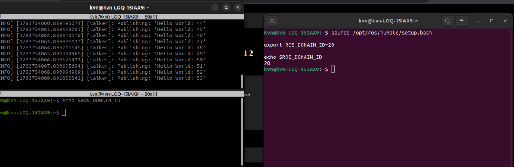
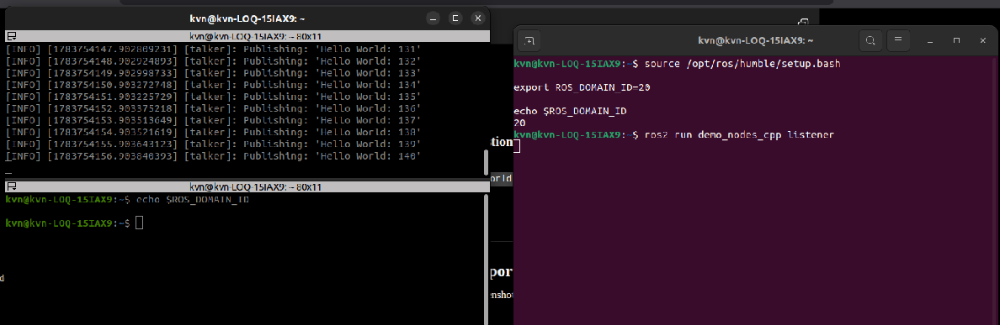
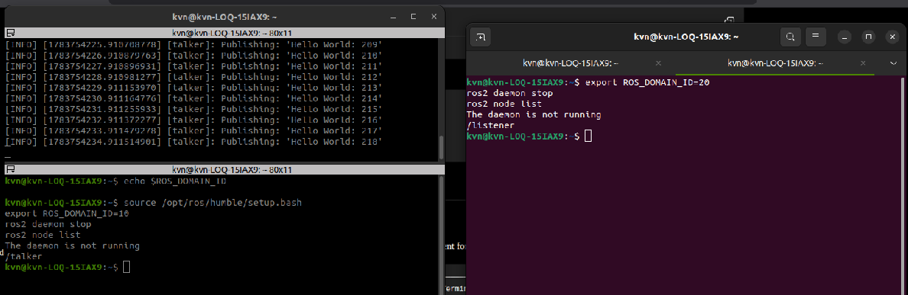

# Investigation B — Domain Isolation using ROS_DOMAIN_ID

> **Engineering Question**
>
> **Why does changing only `ROS_DOMAIN_ID` completely stop communication between two ROS 2 nodes?**

---

# Objective

To investigate how `ROS_DOMAIN_ID` affects node discovery and understand why ROS 2 uses logical communication domains.

---

# Hypothesis

Before performing the experiment, I expected that:

- Two nodes running in different `ROS_DOMAIN_ID`s would not discover each other.
- No messages would be exchanged.
- Neither node should crash or report an error (isolation is silent).
- Each domain should maintain an independent ROS Graph.

---

# Experimental Setup

| | |
|---|---|
| OS | Ubuntu 22.04 LTS |
| ROS | ROS 2 Humble |
| Middleware | Fast DDS (`rmw_fastrtps_cpp`) |
| Talker domain | `10` |
| Listener domain | `20` |
| Scope | One laptop. Same topic name (`/chatter`). |

| Node | ROS_DOMAIN_ID |
|------|---------------|
| Talker | 10 |
| Listener | 20 |

---

# Commands Used

## Terminal 1 — Talker (domain 10)

```bash
source /opt/ros/humble/setup.bash

export ROS_DOMAIN_ID=10

echo $ROS_DOMAIN_ID   # should print 10

ros2 run demo_nodes_cpp talker
```

---

## Terminal 2 — Listener (domain 20)

```bash
source /opt/ros/humble/setup.bash

export ROS_DOMAIN_ID=20

echo $ROS_DOMAIN_ID   # should print 20

ros2 run demo_nodes_cpp listener
```

---

## Verify independent ROS Graphs

The ROS 2 CLI talks to a background **daemon** that caches graph state for a domain. If you change `ROS_DOMAIN_ID` in a terminal without restarting that daemon, `ros2 node list` can show stale or wrong results.

**Always stop the daemon after switching domains**, then list nodes:

### Domain 10

```bash
source /opt/ros/humble/setup.bash

export ROS_DOMAIN_ID=10

ros2 daemon stop

ros2 node list
```

Expected: `/talker` only (while talker is running on domain 10).

### Domain 20

```bash
source /opt/ros/humble/setup.bash

export ROS_DOMAIN_ID=20

ros2 daemon stop

ros2 node list
```

Expected: `/listener` only (while listener is running on domain 20).

---

# Expected Results

- Talker keeps publishing; listener prints no “I heard” lines.
- No crash and no error about “domain mismatch.”
- `ros2 node list` on domain 10 sees `/talker`; on domain 20 sees `/listener`.

---

# Actual Results

| Expectation | Observed |
|---|---|
| No message delivery across domains | Supported — listener terminal shows no received chatter while talker publishes (`expB_no_discovery.png`). Note: that screenshot captures listener **startup**, not a long silent run. |
| Silent isolation (no crash) | Confirmed — both processes keep running. |
| Independent graphs | Confirmed — after `ros2 daemon stop`, domain 10 lists `/talker`, domain 20 lists `/listener` (`expB_independent_ros_graphs.png`). |
| Talker env visibly `10` in setup shot | Weak — `expB_setup_different_domains.png` shows listener domain `20` clearly; talker’s `echo $ROS_DOMAIN_ID` pane is empty in that capture. Graph evidence under domain 10 remains the stronger proof that talker was on 10. |

---

# Evidence

## Evidence 1 — Different ROS Domains (setup)



---

## Evidence 2 — No Communication



---

## Evidence 3 — Independent ROS Graphs (strongest)

Uses `ros2 daemon stop` before each `ros2 node list`:



---

# Explanation

ROS 2 maps `ROS_DOMAIN_ID` onto the DDS domain. Discovery and matching only happen between participants in the **same** domain.

Both nodes ran on the same laptop with the same Humble install and Fast DDS RMW. Different domain IDs meant the publisher and subscriber never matched — isolation without an error message.

That silence is an engineering feature (and a debugging trap): a wrong domain looks like “nothing is publishing,” not like a configuration exception.

---

# Key Learnings

- `ROS_DOMAIN_ID` creates logical communication boundaries.
- Nodes in different domains do not discover each other.
- Changing only the domain is enough to isolate ROS graphs on one machine.
- When inspecting the graph after a domain change, run `ros2 daemon stop` or you may misread the CLI.

---

# Experiment Limits

- Single host only.
- Humble + Fast DDS only.
- Setup screenshots do not perfectly label talker as domain `10`; rely on Evidence 3 for graph isolation.

---

# Conclusion

`ROS_DOMAIN_ID` controls discovery scope. Even when OS, ROS version, middleware, and topic name are identical, nodes in different domains do not discover or communicate with each other.
