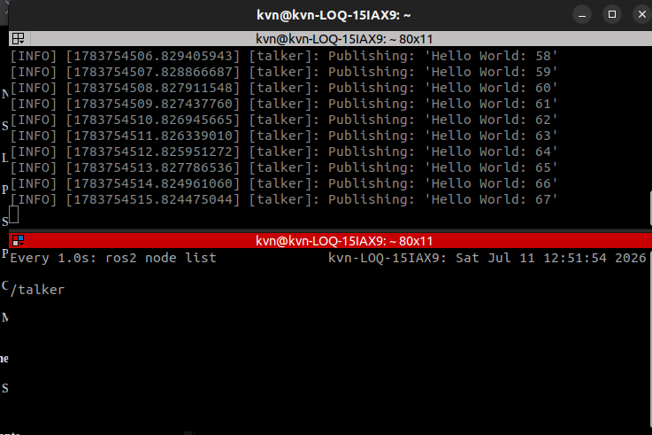
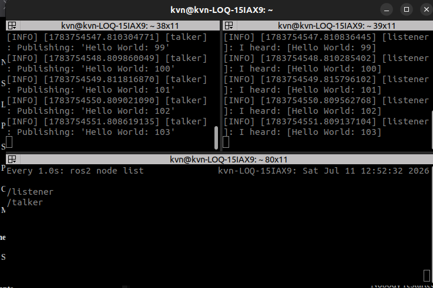
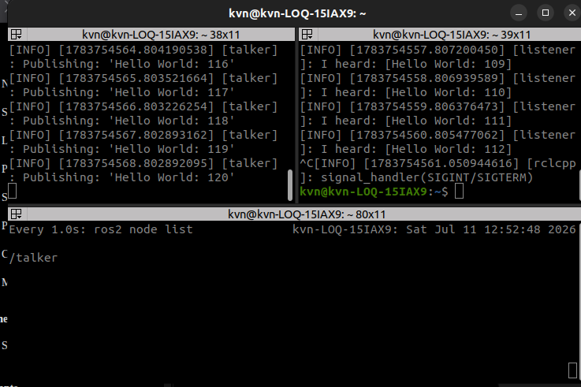

# Investigation C — Dynamic ROS Graph Discovery

> **Engineering Question**
>
> **How can ROS 2 nodes join and leave a running system without restarting other nodes?**

---

# Objective

To investigate how the ROS Graph changes dynamically when nodes join or leave a running ROS 2 system.

---

# Hypothesis

Before performing the experiment, I expected that:

- A newly started node should appear in the ROS Graph without restarting existing nodes.
- Stopping a node should remove it from the graph after discovery / liveliness updates (not necessarily in the same instant as Ctrl+C).
- Existing nodes should continue operating.
- No ROS Master would be required to maintain the graph.

---

# Experimental Setup

| | |
|---|---|
| OS | Ubuntu 22.04 LTS |
| ROS | ROS 2 Humble |
| Middleware | Fast DDS (`rmw_fastrtps_cpp`) |
| Domain | `ROS_DOMAIN_ID=10` |
| Monitor | `watch -n 1 ros2 node list` |

---

# Commands Used

## Terminal 1 — Talker

```bash
source /opt/ros/humble/setup.bash

export ROS_DOMAIN_ID=10

ros2 run demo_nodes_cpp talker
```

---

## Terminal 2 — ROS Graph monitor

```bash
source /opt/ros/humble/setup.bash

export ROS_DOMAIN_ID=10

watch -n 1 ros2 node list
```

---

## Terminal 3 — Listener (join, then leave)

```bash
source /opt/ros/humble/setup.bash

export ROS_DOMAIN_ID=10

ros2 run demo_nodes_cpp listener
```

Stop the listener with `Ctrl+C`. Watch the monitor pane until `/listener` disappears (may take a short time after SIGINT).

---

# Expected Results

1. With only talker running: `ros2 node list` shows `/talker`.
2. After listener starts: list shows `/talker` and `/listener`; chatter matches.
3. After listener exits: list returns to `/talker` only; talker keeps publishing.

---

# Actual Results

| Expectation | Observed |
|---|---|
| Initial graph = talker only | Confirmed (`expC_before_listener.png`, watch ~12:51). |
| Listener join updates graph | Confirmed — `/listener` + `/talker`, matching Hello World counts (`expC_after_listener_joined.png`, ~12:52:32). |
| Listener leave updates graph | Confirmed — SIGINT on listener; watch returns to `/talker` only; talker still publishing (`expC_after_listener_exit.png`, ~12:52:48). |
| “Immediate” removal | Softened — join appeared on the next watch refresh; leave took a short interval after Ctrl+C (participant liveliness / lease), not a guaranteed zero-latency delete. |

---

# Evidence

## Result 1 — Initial ROS Graph

Only the talker node was active.



---

## Result 2 — Listener joins the system

The ROS Graph updated after the listener started.



---

## Result 3 — Listener leaves the system

After stopping the listener, the graph returned to showing only the talker.



---

# Explanation

ROS 2 discovery runs through DDS (via RMW). Nodes advertise presence; other participants learn about publishers, subscribers, and peers on the same domain.

When a node starts, it becomes visible in the ROS Graph once discovery completes. When a node shuts down or becomes unavailable, its participant is eventually dropped from the graph after liveliness / lease handling — the CLI view updates as that information propagates. That is not the same object as “DDS deletes a ROS Graph API entry,” but the observable effect for engineers is: join and leave without restarting peers.

---

# Key Learnings

- The ROS Graph is a live view of discovered participants — it is not a static Master registry.
- Nodes can join a running system on the same domain without restarting peers.
- Nodes can leave without stopping the rest of the system.
- Removal from `ros2 node list` can lag briefly after Ctrl+C.

---

# Experiment Limits

- Single host, Humble Fast DDS, domain `10` only.
- Watched `ros2 node list` at 1 Hz — not a precise discovery latency measurement.

---

# Conclusion

The ROS Graph updates as nodes join and leave through DDS-based distributed discovery. Peers do not need a Master and do not need to restart when another node comes or goes.
