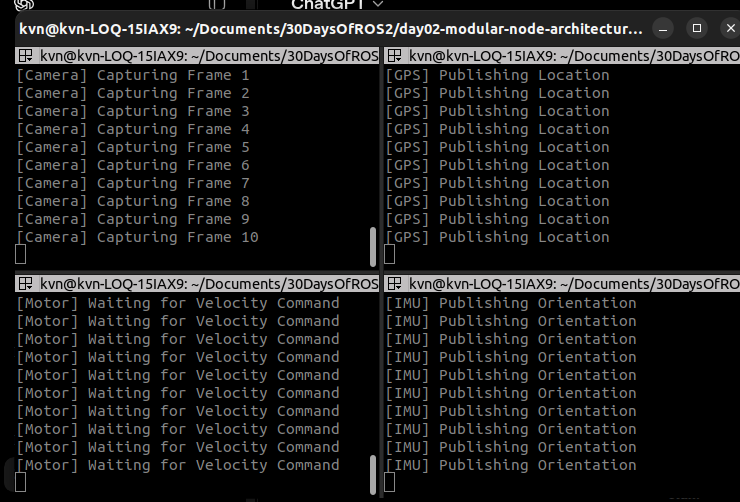
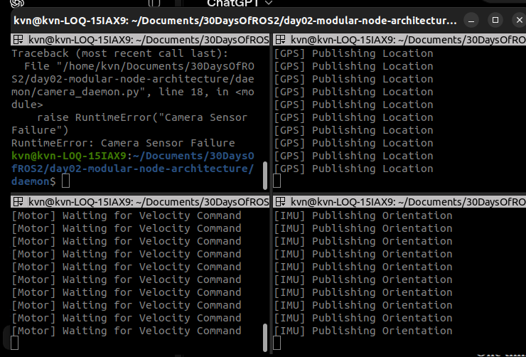

# Investigation B — Fault Isolation Through Independent Processes

## Engineering Question

Can independent software modules continue operating even if one module crashes?

---

## Hypothesis

If each robotic subsystem executes as an independent process, then a failure in one process should not terminate the remaining processes.

---

## Experimental Setup

Four independent Python programs were created to simulate a modular robotic system.

The following daemons were executed simultaneously:

- Camera Daemon
- GPS Daemon
- IMU Daemon
- Motor Daemon

Each daemon was executed in its own terminal window, representing independent operating system processes.

---

## Procedure

1. Launch all four daemons simultaneously.
2. Verify that each daemon executes independently.
3. Intentionally generate an exception inside the Camera Daemon.
4. Observe the behaviour of the remaining daemons.

---

## Observations

Before the failure:

- Camera Daemon was running.
- GPS Daemon was running.
- IMU Daemon was running.
- Motor Daemon was running.

After the Camera Daemon crashed:

- Camera Daemon terminated.
- GPS Daemon continued running.
- IMU Daemon continued running.
- Motor Daemon continued running.

The remaining daemons were completely unaffected by the Camera Daemon failure.

### All four daemons running as independent processes

---

### The Camera daemon crashes while the others keep running

---

## Analysis

Unlike the monolithic architecture demonstrated in Investigation A, each subsystem was executed as an independent operating system process.

Since every daemon had its own execution context and memory space, the operating system isolated the failure to only the Camera Daemon.

This behaviour demonstrates **Fault Isolation**, where failures are contained within the affected module instead of propagating throughout the entire robotic system.

This architectural principle significantly improves the robustness and reliability of robotic software.

---

## Conclusion

Independent processes provide fault isolation.

A software failure inside one subsystem does not terminate unrelated subsystems, allowing the robotic system to continue operating despite partial failures.

ROS 2 encourages modular **nodes**, but this investigation only proved the **process** half of the story. Investigation C asks whether a ROS 2 node boundary alone is enough — or whether isolation still requires separate processes.

---

## Real Robotics Connection

Consider an autonomous search and rescue robot equipped with multiple sensors.

If the camera driver unexpectedly crashes:

- IMU data can still be published.
- GPS localisation can continue.
- Motor control can remain operational.
- The robot can safely stop, switch to an alternative sensing strategy, or notify an operator instead of shutting down completely.

This level of reliability is only possible because the robot is designed as a collection of independent modules rather than one monolithic application.

---

## Key Takeaways

- Each subsystem should have a single responsibility.
- Independent processes improve software reliability.
- Faults remain isolated to the affected module.
- Modular architectures are easier to maintain and extend.
- The next question (Investigation C): does a ROS 2 *node* provide this isolation, or only an OS *process*?