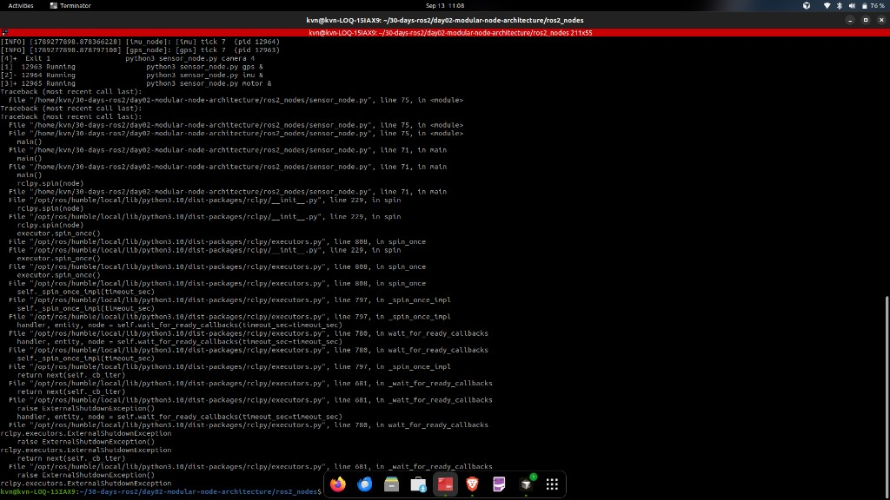
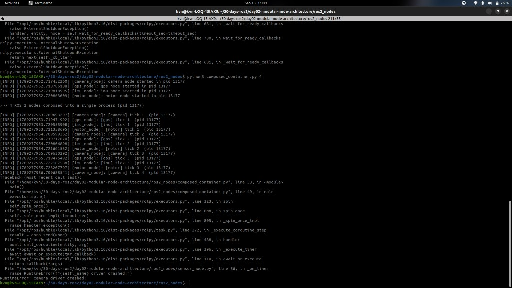

# Investigation C — Is the Node Boundary the Fault Boundary?

## Engineering Question

Investigations A and B compared **one process** against **four processes**.

But ROS 2 is organised around **nodes**, not processes.

> Does splitting a robot into separate ROS 2 **nodes** give fault isolation — or does fault isolation come from something else?

---

## Why this investigation exists

After Investigation B it is tempting to conclude:

> "Separate nodes → separate failures → ROS 2 is fault tolerant."

That conclusion does not survive contact with ROS 2.

A ROS 2 node is a unit of *responsibility* — a named participant in the ROS graph. Where that node executes is a separate, deploy-time decision. ROS 2 supports loading many nodes into one process (composition).

This investigation runs the **same four nodes** two ways and changes nothing else.

---

## Hypothesis

1. **C1:** Four sensor nodes in four processes → camera crash leaves GPS, IMU, and Motor alive.
2. **C2:** Same four nodes in one process → camera crash kills the process → zero survivors.
3. Node modularity can look the same in both runs; only process layout changes who lives.

If both survive (or both die), “process = fault boundary” is wrong for this setup.

---

## Experimental Design

`sensor_node.py` defines one `SensorNode` class. Both runs use that class, the same fault, the same timer period, and the same topics: `/camera/status`, `/gps/status`, `/imu/status`, `/motor/status`.

**Controlled variable:** how many OS processes host the four nodes.

| | Nodes | Processes | Executors |
|---|:---:|:---:|:---:|
| **C1 — Separate processes** | 4 | 4 | 4 |
| **C2 — Composed container** | 4 | **1** | 1 |

The camera raises `RuntimeError("camera driver crashed!")` on its 4th timer callback. The exception is left unhandled so we can measure how far the fault propagates.

C2 uses a Python `SingleThreadedExecutor` as an honest stand-in for “many nodes, one process” (the same idea as C++ `ComposableNodeContainer`, not a claim of identical APIs).

---

## Environment

| | |
|---|---|
| OS | Ubuntu 22.04 LTS |
| ROS 2 | Humble |
| Domain | `ROS_DOMAIN_ID=42` |
| Working directory | `ros2_nodes/` |

---

## Procedure

```bash
source /opt/ros/humble/setup.bash
export ROS_DOMAIN_ID=42
cd ros2_nodes

# Automated (preferred once the script sources Humble safely):
bash run_investigation_c.sh

# Or manually:
# C1
python3 sensor_node.py gps &
python3 sensor_node.py imu &
python3 sensor_node.py motor &
python3 sensor_node.py camera 4 &
# observe jobs; then stop survivors

# C2
python3 composed_container.py 4
```

---

## Expected Results

| Run | Expect |
|---|---|
| C1 | Camera exits; GPS/IMU/Motor keep ticking with different PIDs |
| C2 | All four nodes share one PID; camera fault ends the whole process |

---

## Actual Results

Observed on 2026-09-13 (manual run; script initially failed because `set -u` broke sourcing Humble — fixed afterward).

### Result C1 — Four nodes, four processes

After the camera fault, job control showed:

```text
[4]+  Exit 1    python3 sensor_node.py camera 4
[1]   Running   python3 sensor_node.py gps &      # pid 12963
[2]   Running   python3 sensor_node.py imu &      # pid 12964
[3]+  Running   python3 sensor_node.py motor &    # pid 12965
```

Survivors were still publishing (e.g. imu/gps at **tick 7**) after the camera had already exited.



**Three of four subsystems survived.**

Note: `ExternalShutdownException` lines appearing after survivors were stopped are **cleanup** (interrupt/`kill` of remaining jobs), not evidence that the camera fault killed them. The decisive observation is camera `Exit 1` while the other three were still `Running`.

### Result C2 — The same four nodes, one process

Every node reported the **same** PID (`13177`):

```text
>>> 4 ROS 2 nodes composed into a single process (pid 13177)
[camera] tick 4  (pid 13177)
RuntimeError: camera driver crashed!
```

The composed process terminated. GPS, IMU, and Motor did not continue independently.



**All four subsystems died together — same fate pattern as Investigation A.**

---

## Analysis

| | C1 | C2 |
|---|---|---|
| Nodes | 4 | 4 |
| Processes | 4 | 1 |
| After camera fault | 3 survivors | 0 survivors |

Architecture (four named nodes) was the same idea in both runs. Reliability was not.

The node boundary did not contain the failure. The **process** boundary did.

In C2, four nodes shared one executor/process. An unhandled exception escaping a callback unwound `spin()` and took every neighbour with it.

> **A ROS 2 node is a unit of responsibility, not a unit of failure.**
>
> Architecture decides *what* the modules are. Deployment decides *whether a failure in one can reach another*.

---

## So — should every sensor be a separate node?

**Yes to separate nodes; “it depends” to separate processes.**

Separate nodes buy separation of concerns, testing, reuse, clean interfaces, and the *option* of isolation later.

Whether those nodes get their own processes is a deploy-time trade-off:

| | Separate processes | Composed into one process |
|---|---|---|
| Fault isolation | Contained by the OS | One fault can kill all |
| Large-message cost | Serialize across processes | Lower overhead in-process |
| Typical use | Drivers, safety-critical | Tight perception pipelines |

The mistake is composing nodes and *assuming* you still have the isolation drawn on the architecture diagram.

---

## Conclusion

- Nodes give **separation of concerns**. Processes give **fault isolation**.
- ROS 2 deliberately decouples the two (composition is a deploy-time choice).
- Investigation B was real; its cause was the process boundary, not the node boundary.
- Hypotheses 1–2 were supported by this run’s evidence.

---

## Real Robotics Connection

Production systems do not stop at “split it into nodes”:

- Perception pipelines may be composed for performance.
- Drivers and safety-critical control usually keep process isolation.
- Supervisors / respawn / lifecycle handle recovery after isolation contains a fault.

---

## Key Takeaways

- A ROS 2 node is not an OS process.
- The same four nodes survive or die together depending on deployment.
- Fault isolation comes from process boundaries enforced by the OS.
- Composition trades fault isolation for communication efficiency — deliberately.
- If you cannot say how many processes your robot runs in, you cannot say how fault tolerant it is.
